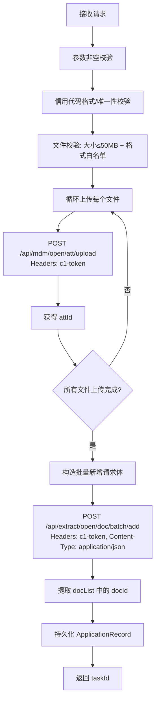

# 企业材料上传与信息采集 — 文件上传功能代码说明

> **对应需求**：业务需求说明书 — 企业材料上传与信息采集（步骤1）
>
> **参考 API 文档**：`api.json`（Postman Collection — dib_api）
>
> **最后修改日期**：2026-07-08

---

## 一、修改概述

根据需求文档和 `api.json` 中的接口定义，对原有代码进行了重构。**核心变更**：将原本的"本地文件存储 + 保存路径"模式，替换为"调用外部 API 上传附件 → 调用资料批量新增接口 → 持久化文档 ID"的完整链路。

| 维度 | 修改前 | 修改后 |
|------|--------|--------|
| 文件存储 | 本地文件存储 | 调用 `POST /api/mdm/open/att/upload` |
| 资料入库 | 无（仅存文件路径） | 调用 `POST /api/extract/open/doc/batch/add` |
| 请求字段 | camelCase 绑定 | snake_case (`credit_code`, `customer_no`) |
| 鉴权 | 无 | `c1-token` 统一在配置文件设置 |
| 财报日期 | 无 | 新增 `report_date` 字段 |
| 任务记录 | 存 `fileUrls` | 存 `docIds` + `attIds` |
| 配置格式 | `application.yml` | `application.properties` |

---

## 二、文件变更清单

### 2.1 新增文件（5 个）

| # | 文件路径 | 用途 |
|---|---------|------|
| 1 | `config/ApiProperties.java` | 外部 API 配置属性类，注入 `api.*` 配置 |
| 2 | `config/RestTemplateConfig.java` | RestTemplate Bean 定义 |
| 3 | `dto/external/AttachmentUploadResponse.java` | 附件上传接口的响应体 DTO |
| 4 | `dto/external/DocBatchAddItem.java` | 资料批量新增的请求项 DTO |
| 5 | `dto/external/DocBatchAddResponse.java` | 资料批量新增的响应体 DTO（含 `DocInfo` 内部类） |

### 2.2 修改文件（7 个）

| # | 文件路径 | 变更要点 |
|---|---------|---------|
| 1 | `application.yml` → `application.properties` | 配置格式从 yml 转为 properties；新增 `api.*` 配置段；移除 MinIO、`storage-type`、`local-storage-path` |
| 2 | `dto/request/UploadMaterialsRequest.java` | 新增 `reportDate` 字段 |
| 3 | `dto/response/ApiResponse.java` | 统一响应格式：成功时 `code: "1", message: "操作成功"`；失败时返回 `errorMessage` |
| 4 | `controller/MaterialUploadController.java` | 改用 `@RequestParam` + snake_case 参数名；移除 `c1-token` 请求头（改由配置文件统一设置） |
| 5 | `service/MaterialUploadService.java` | 接口方法简化，移除 `c1Token` 参数 |
| 6 | `service/impl/MaterialUploadServiceImpl.java` | **核心重写**：替换本地存储为外部 API 调用链路；token 从 `ApiProperties` 读取 |
| 7 | `entity/ApplicationRecord.java` | 新增 `reportDate`、`docIds`、`attIds`；移除旧 `fileUrls` |

### 2.3 删除文件（3 个）

| # | 文件路径 | 原因 |
|---|---------|------|
| 1 | `storage/FileStorageService.java` | 不再需要本地存储层，改用外部 API |
| 2 | `storage/impl/LocalFileStorageService.java` | 同上 |
| 3 | `storage/impl/MinioFileStorageService.java` | 同上 |

---

## 三、核心业务逻辑详解

### 3.1 请求接收

```
POST /techfin/sxd/upload-materials
Content-Type: multipart/form-data
```

| 表单字段 | 类型 | 必填 | 说明 |
|---------|------|------|------|
| `credit_code` | String | 是 | 统一社会信用代码（18位数字/大写字母） |
| `customer_no` | String | 是 | 客户编号 |
| `report_date` | String | 否 | 财报报告日期，格式 `YYYY-MM-DD` |
| `finance_files` | File[] | 否 | 财务报表文件（PDF/Word/Excel/CSV/图片） |
| `business_files` | File[] | 否 | 商业计划书文件（PDF/Word/PPT/图片） |

> **鉴权说明**：下游 API 所需的 `c1-token` 不再由前端传入，统一在 `application.properties` 中配置 `api.default-token`。

### 3.2 处理流程



### 3.3 关键常量（来自 api.json）

| 常量 | 值 | 说明 |
|------|-----|------|
| `projectId` | `1521841328915996672` | 默认项目 ID |
| `dirId` | `0` | 默认目录 ID |
| `docTypeId` (财务报表) | `1273757631042949120` | 文档类型：财务报表 |
| `docTypeId` (商业计划书) | `1455619597903695872` | 文档类型：商业计划书 |
| `extraInfo` | `"{}"` | 扩展信息默认值 |

### 3.4 外部 API 调用

**附件上传** `POST /api/mdm/open/att/upload`

```
Request:  multipart/form-data, file=<文件流>
Headers:  c1-token: <从配置文件读取>
Response: { "success": true, "code": "1", "data": "1522260339629744128" }
```

**资料批量新增** `POST /api/extract/open/doc/batch/add`

```json
Request: [
  {
    "attId": "1522655358249328640",
    "dirId": 0,
    "docName": "商业计划书.pdf",
    "docSize": 791,
    "docTypeId": 1455619597903695872,
    "extraInfo": "{}",
    "projectId": 1521841328915996672,
    "reportDate": "2025-06-30"
  }
]
Headers: c1-token: <从配置文件读取>, Content-Type: application/json

Response: {
  "success": true,
  "code": "1",
  "data": {
    "docList": [{ "id": "1522656394616045568", ... }]
  }
}
```

---

## 四、数据库实体变更

### application_record 表

| 字段 | 类型 | 说明 |
|------|------|------|
| `id` | BIGINT (PK) | 自增主键 |
| `task_id` | VARCHAR(64) | 任务 ID，唯一 |
| `credit_code` | VARCHAR(18) | 统一社会信用代码 |
| `customer_no` | VARCHAR(64) | 客户编号 |
| `report_date` | VARCHAR(10) | 财报报告日期 **（新增）** |
| `status` | VARCHAR(32) | 任务状态枚举 |
| `created_at` | DATETIME | 创建时间 |
| `updated_at` | DATETIME | 更新时间 |

### application_doc 表（新增）

| 字段 | 类型 | 说明 |
|------|------|------|
| `application_id` | BIGINT (FK) | 关联申请记录 |
| `doc_id` | VARCHAR(64) | 资料批量新增返回的文档 ID |

### application_att 表（新增）

| 字段 | 类型 | 说明 |
|------|------|------|
| `application_id` | BIGINT (FK) | 关联申请记录 |
| `att_id` | VARCHAR(64) | 附件上传返回的附件 ID |

---

## 五、配置项说明

### application.properties（完整）

```properties
# -------- 服务器 --------
server.port=8080
server.servlet.context-path=/techfin
server.servlet.multipart.max-file-size=50MB
server.servlet.multipart.max-request-size=200MB

# -------- 数据库 --------
spring.datasource.url=jdbc:mysql://localhost:3306/mydb?useUnicode=true&characterEncoding=utf-8&serverTimezone=Asia/Shanghai
spring.datasource.username=qiu
spring.datasource.password=Qiu@2026
spring.datasource.driver-class-name=com.mysql.cj.jdbc.Driver

# -------- JPA --------
spring.jpa.hibernate.ddl-auto=update
spring.jpa.show-sql=true
spring.jpa.properties.hibernate.format_sql=true

# -------- Jackson --------
spring.jackson.property-naming-strategy=SNAKE_CASE

# -------- 文件上传校验 --------
file.upload.max-file-size=52428800
file.upload.timeout-seconds=120
file.upload.allowed-extensions.finance[0]=pdf
file.upload.allowed-extensions.finance[1]=doc
...
file.upload.allowed-extensions.business[0]=pdf
...

# -------- 外部 API（核心配置） --------
api.base-url=https://dde56f98-8e6c-4d2c-adea-5f3cfa1a4327.mock.pstmn.io
api.attachment-upload-url=${api.base-url}/api/mdm/open/att/upload
api.doc-batch-add-url=${api.base-url}/api/extract/open/doc/batch/add
api.project-id=1521841328915996672
api.dir-id=0
api.doc-type.finance=1273757631042949120
api.doc-type.business=1455619597903695872
api.default-token=your-c1-token-here
```

### 配置字段说明

| 属性 | 说明 |
|------|------|
| `api.base-url` | API 网关基础地址（当前为 Postman Mock Server） |
| `api.attachment-upload-url` | 附件上传接口完整地址 |
| `api.doc-batch-add-url` | 资料批量新增接口完整地址 |
| `api.project-id` | 项目 ID（固定值） |
| `api.dir-id` | 目录 ID（固定值 0） |
| `api.doc-type.finance` | 财务报表的文档类型 ID |
| `api.doc-type.business` | 商业计划书的文档类型 ID |
| `api.default-token` | **下游 API 鉴权 token**，统一在此配置 |

---

## 六、错误码一览

| 错误码 | 触发条件 | HTTP 状态码 |
|--------|---------|------------|
| `PARAM_MISSING` | `credit_code` 或 `customer_no` 为空 | 400 |
| `INVALID_CREDIT_CODE` | 信用代码格式不正确 | 400 |
| `DUPLICATE_CREDIT_CODE` | 信用代码已存在 | 400 |
| `INVALID_FILE_FORMAT` | 文件格式不在白名单内 | 400 |
| `FILE_TOO_LARGE` | 文件超过 50MB | 400 |
| `ATTACH_UPLOAD_FAILED` | 附件上传接口调用失败 | 400 |
| `BATCH_ADD_FAILED` | 资料批量新增接口调用失败 | 400 |
| `NO_FILES` | 未上传任何文件 | 400 |
| `SYSTEM_BUSY` | 未捕获的系统异常 | 500 |

---

## 七、后续清理与变更记录

### 7.1 移除 MinIO 与本地存储层

文件上传全部通过外部 API 完成，不再需要本地文件存储。

**删除的文件：** `storage/FileStorageService.java`、`storage/impl/LocalFileStorageService.java`、`storage/impl/MinioFileStorageService.java`（整个 `storage/` 包已删除）。

**移除的依赖：**

```xml
<!-- pom.xml 中移除 -->
<dependency>
    <groupId>io.minio</groupId>
    <artifactId>minio</artifactId>
    <version>${minio.version}</version>
</dependency>
```

**移除的配置：**

| 配置项 | 原因 |
|--------|------|
| `file.upload.storage-type` | 不再区分存储模式 |
| `file.upload.local-storage-path` | 不再本地存储 |
| `minio.*` (整段) | MinIO 不再使用 |

### 7.2 配置格式转换

`application.yml` → `application.properties`，内容等价，便于后续维护。

### 7.3 c1-token 改为配置文件统一管理

- 原方案：前端通过请求头 `c1-token` 传入，服务端透传至下游 API
- 现方案：下游 API 鉴权所需的 `c1-token` 统一在 `application.properties` 的 `api.default-token` 中配置
- 对应代码简化：Controller 移除 `@RequestHeader("c1-token")`，Service 接口及实现移除 `c1Token` 参数

### 7.4 未变更的留存文件

以下文件功能正常，未作改动，仍在使用：

| 文件 | 用途 |
|------|------|
| `validator/FileValidator.java` | 文件大小与格式校验 |
| `config/FileUploadConfig.java` | 文件上传配置属性（白名单、大小限制） |
| `exception/BusinessException.java` | 业务异常基类 |
| `exception/FileValidationException.java` | 文件校验异常 |
| `exception/GlobalExceptionHandler.java` | 全局异常处理器 |
| `enums/FileType.java` | 文件类型枚举 |
| `enums/TaskStatus.java` | 任务状态枚举 |
| `repository/ApplicationRecordRepository.java` | 数据仓库接口 |

---

## 八、与需求文档的对照

| 需求条目 | 实现情况 | 对应代码 |
|---------|---------|---------|
| §2.1 基础信息录入（信用代码18位校验） | ✅ | `UploadMaterialsRequest.java:16` + `validateRequiredParams()` |
| §2.2-A 财务报表（PDF/Word/Excel/CSV/图片 ≤50MB） | ✅ | `application.properties` → `file.upload.allowed-extensions.finance` |
| §2.2-B 商业计划书（PDF/Word/PPT/图片 ≤50MB） | ✅ | `application.properties` → `file.upload.allowed-extensions.business` |
| §3.1 参数非空校验 | ✅ | `validateRequiredParams()` |
| §3.2 文件流校验（大小+格式，异常中断+文件名提示） | ✅ | `FileValidator.validate()` + `FileValidationException` |
| §3.3 附件上传接口调用 | ✅ | `uploadAttachment()` → `POST /api/mdm/open/att/upload` |
| §3.4 资料批量新增接口调用 | ✅ | `batchAddDocs()` → `POST /api/extract/open/doc/batch/add` |
| §3.5 持久化申请记录 + 文件 ID | ✅ | `ApplicationRecord` 含 `docIds`, `attIds` |
| §4.1 性能要求（并发限制） | ⚠️ | 待后续通过限流组件实现 |
| §5.1 重复提交/幂等性 | ✅ | `checkCreditCodeUnique()` 提供基础防重 |
